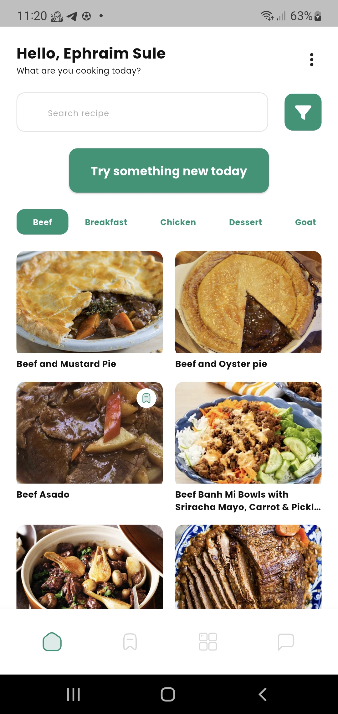
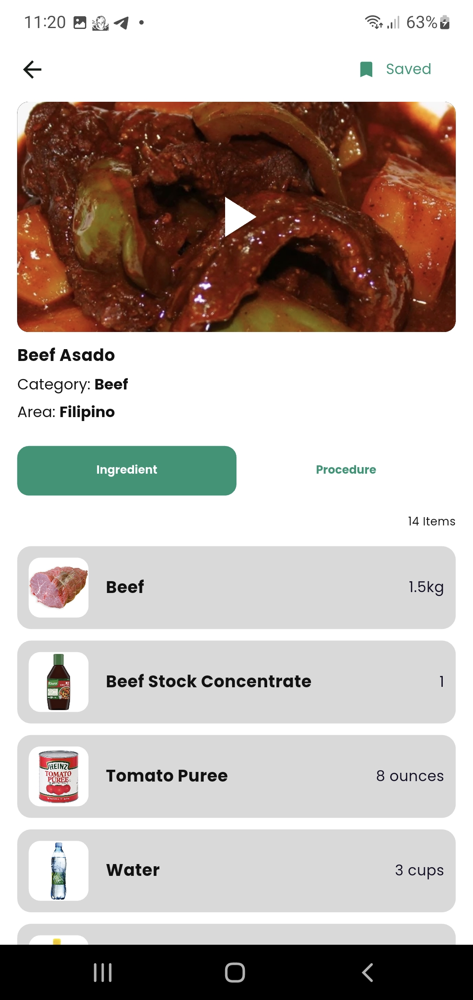
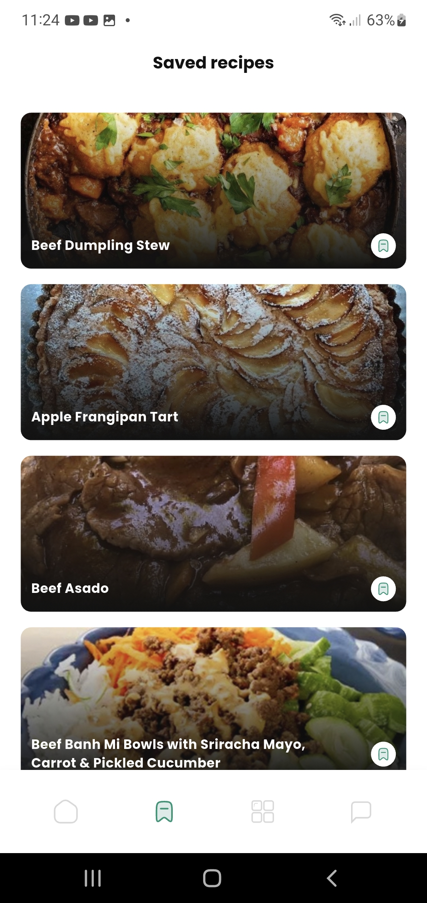

# Chef Kiss - Your Daily Recipe Companion 👨‍🍳👩‍🍳

## 🌟 Project Overview

**Chef Kiss** is a delightful and intuitive mobile application built with Flutter, designed to help food enthusiasts discover, explore, and manage a vast collection of delicious meal recipes. Leveraging the comprehensive TheMealDB API, the app provides a seamless experience for searching meals, Browse by category or ingredient, viewing detailed cooking instructions, and saving favorite recipes for quick access.

This project focuses on delivering a clean, modern UI, efficient data handling, and robust state management using GetX, ensuring a smooth and responsive user experience across various devices.

## ✨ Features

* **Extensive Meal Search:** Quickly find recipes by meal name or by their first letter.
* **Categorized Browse:** Explore meals neatly organized into categories (e.g., Seafood, Dessert, Breakfast).
* **Ingredient-Based Filtering:** Discover recipes using specific ingredients you have on hand (e.g., Chicken, Pasta, Rice).
* **Detailed Recipe View:** Get comprehensive information for each meal, including:
    * Step-by-step cooking instructions.
    * A structured list of ingredients with their respective measures.
    * A direct link to a YouTube video for cooking guidance.
* **Local Bookmarking:** Save your favorite recipes locally for offline access and quick retrieval.
* **Responsive UI:** Optimized for various screen sizes and orientations using `flutter_screenutil`.
* **Daily Meal Reminders:** Stay engaged with daily local notifications to inspire your cooking.
* **Robust State Management:** Powered by GetX for efficient and scalable state management.
* **Efficient Image Loading:** Utilizes `cached_network_image` for smooth image display and caching.

## 🚀 Screens & Functionality

The application is structured into several key modules, each representing a distinct user interface and set of functionalities:

### 1. Splash Screen

* **Purpose:** The initial screen displayed when the app launches. Used for quick setup, checking authentication status, or loading initial data before navigating to the main content.
* **How it works:** A brief visual introduction to the app.


*(Please replace with your actual Splash Screen screenshot)*

### 2. Authentication Screen (Sign In / Sign Up)

* **Purpose:** Allows users to sign in to their existing account or create a new one. This typically involves email/password or social logins.
* **How it works:** Provides input fields for user credentials and handles the authentication flow.


*(Please replace with your actual Authentication Screen screenshot)*

### 3. Home/Dashboard Screen

* **Purpose:** The central hub of the application, offering various ways to discover meals.
* **How it works:** Displays categories, possibly trending meals, and provides a prominent search bar to find recipes.


*(Please replace with your actual Home Screen screenshot)*

### 4. Meal List / Category & Ingredient Filter Screens

* **Purpose:** Displays meals filtered by a chosen category (e.g., "Seafood") or a specific ingredient (e.g., "Chicken").
* **How it works:** Presents meals in a scrollable grid layout (`AlignedGridView`), allowing users to browse items efficiently. Tapping on a meal navigates to its detail screen.


*(Please replace with your actual Category/Ingredient Filter Screen screenshot)*

### 5. Recipe Detail Screen

* **Purpose:** Provides an in-depth view of a selected meal's recipe.
* **How it works:** Displays a large image of the meal, its category, location, detailed step-by-step instructions, and a clearly laid-out list of ingredients with their respective measurements. It also includes a button to watch the cooking video on YouTube.


*(Please replace with your actual Recipe Detail Screen screenshot)*

### 6. Bookmarks Screen

* **Purpose:** Allows users to view and manage their saved (bookmarked) recipes.
* **How it works:** Displays a list or grid of all recipes the user has marked as favorites, providing quick access without needing to search again.


*(Please replace with your actual Bookmarks Screen screenshot)*

---

## 🛠️ Technologies Used

* **Framework:** Flutter
* **Language:** Dart
* **State Management:** [GetX](https://pub.dev/packages/get)
* **API Integration:** [http](https://pub.dev/packages/http)
* **Image Loading & Caching:** [cached_network_image](https://pub.dev/packages/cached_network_image)
* **Responsive UI:** [flutter_screenutil](https://pub.dev/packages/flutter_screenutil)
* **Grid Layouts:** [flutter_staggered_grid_view](https://pub.dev/packages/flutter_staggered_grid_view)
* **Local Notifications:** [flutter_local_notifications](https://pub.dev/packages/flutter_local_notifications)
* **Timezone Handling:** [timezone](https://pub.dev/packages/timezone)
* **Permissions Handling:** [permission_handler](https://pub.dev/packages/permission_handler)
* **External API:** [TheMealDB.com](https://www.themealdb.com/api.php)

---

## 📂 Project Structure

The project follows a modular and clean architecture for better organization and scalability:
recipe_app/
├── lib/
│   ├── data/
│   │   ├── models/           # Dart models for API responses (e.g., Meal, Category, FilteredMealItem)
│   │   ├── services/         # API service classes (e.g., MealApiService)
│   ├── modules/              # Core application modules/features
│   │   ├── auth/             # Authentication screens and logic
│   │   ├── home/             # Main dashboard and navigation
│   │   ├── recipe_detail/    # Detailed recipe view
│   │   ├── bookmark/         # Bookmarked recipes management
│   │   ├── category_meal/    # Meals filtered by category
│   │   ├── ingredient_meal/  # Meals filtered by ingredient
│   │   ├── profile/          # User profile and settings
│   │   ├── onboarding/       # Onboarding screens
│   │   ├── splash/           # Splash screen
│   │   └── ...
│   ├── routes/               # GetX routing definitions (app_pages.dart, app_routes.dart)
│   ├── utils/                # Utility classes (e.g., constants, text styles, color utils)
│   ├── main.dart             # Application entry point
│   └── ...
├── assets/
│   ├── images/               # App images and placeholders
│   ├── icons/                # SVG icons and other icon assets
│   └── ...
├── pubspec.yaml              # Project dependencies and metadata
├── README.md                 # This documentation file
└── ...

---

## 🛠️ Getting Started

Follow these steps to set up and run the **Chef Kiss** application on your local machine.

### Download APK (Android)

You can download the latest Android application package (APK) directly from Google Drive:

* **[Download Chef Kiss APK](https://drive.google.com/file/d/1w84ADyqNKT8PdhkngrqPDRUNYRPksGks/view?usp=drive_link)**

    *(**Note:** Ensure your device allows installation from unknown sources if downloading directly.)*

### Prerequisites

* **Flutter SDK:** Make sure you have Flutter installed. You can download it from [flutter.dev](https://flutter.dev/docs/get-started/install).
* **Dart SDK:** (Comes with Flutter SDK)
* **IDE:** Visual Studio Code with Flutter extension, or Android Studio with Flutter/Dart plugins.

### Installation

1.  **Clone the repository:**
    ```bash
    git clone [https://github.com/suleohis/recipe_app.git](https://github.com/suleohis/recipe_app.git)
    cd recipe_app
    ```

2.  **Install dependencies:**
    ```bash
    flutter pub get
    ```

### Running the App

1.  **Connect a device or start an emulator/simulator.**
2.  **Run the application:**
    ```bash
    flutter run
    ```
    Or use the "Run" option in your IDE.

---

## 👋 Contributing

Contributions are welcome! If you have suggestions for improvements, new features, or bug fixes, please open an issue or submit a pull request.

1.  Fork the repository.
2.  Create your feature branch (`git checkout -b feature/AmazingFeature`).
3.  Commit your changes (`git commit -m 'Add some AmazingFeature'`).
4.  Push to the branch (`git push origin feature/AmazingFeature`).
5.  Open a Pull Request.

---

## 📄 License

This project is licensed under the MIT License. See the `LICENSE` file for more details.

---

# To save the images in assets
dart run build_runner build
